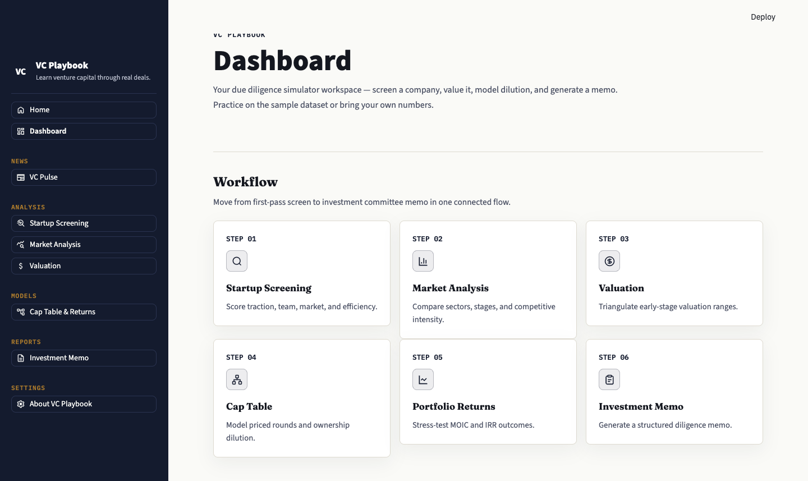
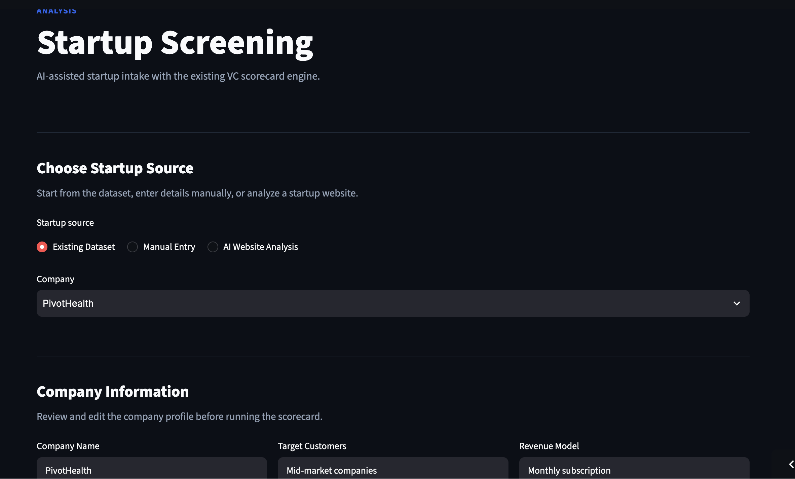
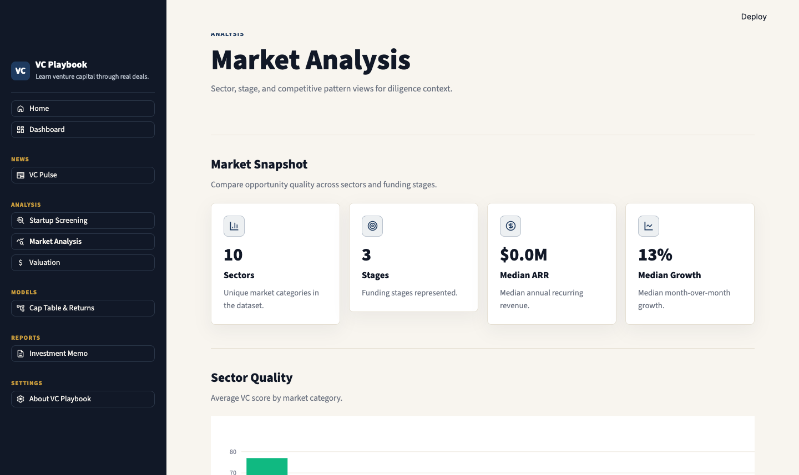
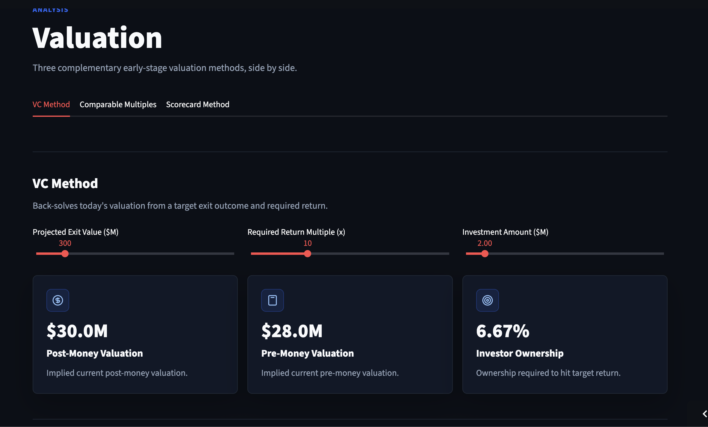
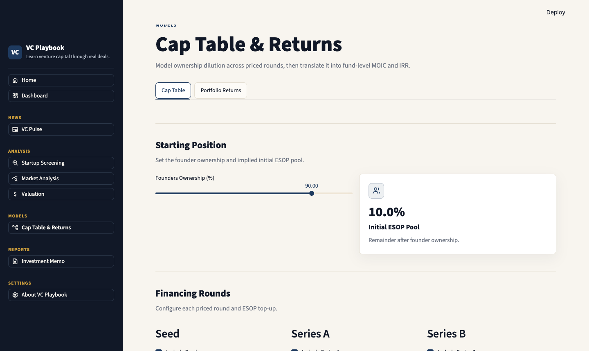
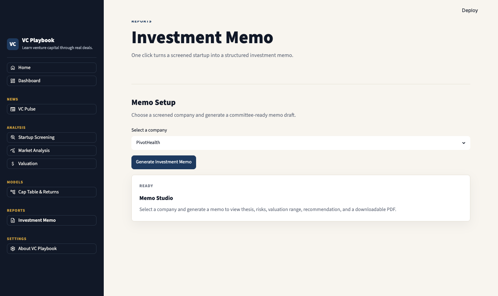
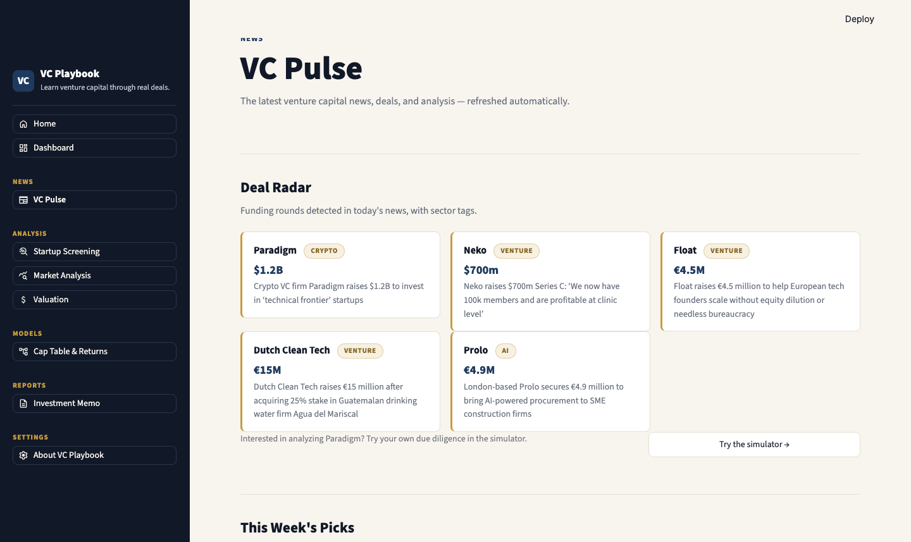

# 📗 VC Playbook

**Learn venture capital by reading the news and running the numbers.**

VC Playbook is two things in one Streamlit app:

1. **VC Pulse** — a live news hub aggregating the latest venture capital headlines from TechCrunch, Crunchbase News, Axios, and more, plus curated videos and articles.
2. **A due diligence simulator** — an interactive sandbox that walks you through how professional investors evaluate startups: weighted scorecards, three valuation methods, cap table dilution, fund returns, and auto-drafted investment memos.

🚀 **[Live Demo](https://vc-lab-5mg6vkhrt7uucrxjnowfe3.streamlit.app/)**

Built for VC-curious students, analysts, and juniors — get your industry news in one place, and practice real diligence on the sample dataset or your own numbers (manual entry or CSV upload).

**Real-world test:** when Bending Spoons IPO'd at $18.4B (July 2026), the simulator's comps module priced its disclosed numbers at $19.2B — within 4% — while the seed-stage scorecard honestly said "Watch." Full walkthrough: [Case study](reports/case-study-bending-spoons.md).

**Where this fits:** VC Playbook is not a replacement for professional tooling like Affinity, Harmonic, or Tactyc — those manage real deal flow with real data. This is a learning tool that shows the *shape* of the work: what a scorecard, a valuation triangulation, a dilution model, and an IC memo actually look like, with every formula open-source and every assumption exposed.

---

## Screenshots

## Dashboard

---
## Startup Screening

---
## Market Analysis

---
## Valuation

---
## Cap Table & Returns

---
## Investment Memo

---
## VC Pulse — Live News & Deal Radar


---

## The Simulator Workflow

1. **Screen** a startup against a weighted scorecard — from the sample dataset, manual entry, or your own CSV
2. **Value** it using three standard methodologies (VC Method, comparable multiples, scorecard method)
3. **Model** ownership dilution across funding rounds
4. **Project** portfolio returns and stress-test exit scenarios
5. **Generate** a structured investment memo — downloadable as PDF

A beginner glossary explains every term (ARR, LTV, CAC, MOIC, IRR, dilution…) along the way.

---

## Features

| Module | What it does |
|---|---|
| 📰 **VC Pulse** | Live VC news wall from RSS feeds + curated learning resources |
| 📊 **Startup Screening** | Weighted VC scorecard (unit economics, growth, market, team, efficiency) with a radar chart, manual entry, and CSV upload |
| 💰 **Valuation Engine** | VC Method, Comparable Multiples, and Scorecard Method — with live sliders |
| 📈 **Cap Table Simulator** | Model dilution across Seed → Series A → Series B, including ESOP top-ups |
| 📉 **Portfolio Returns** | MOIC, IRR, and an exit-valuation × holding-period sensitivity heatmap |
| 📚 **Investment Memo** | One click generates a thesis, risk assessment, valuation, and recommendation — downloadable as PDF |

---

## Tech Stack

| Component | Technology |
|---|---|
| App | Streamlit |
| Models | Python + Pandas + NumPy |
| Charts | Plotly |
| News | RSS via feedparser |
| PDF Reports | ReportLab |
| Data | Synthetic startup dataset (28 companies, 10 sectors) — or bring your own CSV |

---

## Repository Structure

```
VC-Playbook/
├── README.md
├── requirements.txt
├── runtime.txt                         # Pins Python for Streamlit Cloud
├── app/
│   ├── app.py                          # Landing page (news + deal radar)
│   ├── services/                       # News aggregation, memo drafting, PDF
│   └── pages/
│       ├── 0_Dashboard.py
│       ├── 1_Startup_Screening.py
│       ├── 2_Valuation.py
│       ├── 3_Cap_Table_Returns.py
│       ├── 4_Investment_Memo.py
│       ├── 5_Market_Analysis.py
│       ├── 6_VC_Pulse.py               # News hub
│       └── 7_About.py
├── data/
│   ├── startups.csv                    # Synthetic dataset (28 companies)
│   ├── weekly_picks.json               # Hand-curated deals & spotlight (edit weekly)
│   └── generate_data.py                # Regenerate the dataset
├── models/
│   ├── scoring.py                      # VC scorecard model
│   ├── valuation.py                    # VC Method / Comps / Scorecard
│   ├── cap_table.py                    # Round-by-round dilution engine
│   └── returns.py                      # MOIC / IRR / sensitivity
├── tests/
│   └── test_models.py                  # Pytest suite for the model layer
├── reports/
│   └── VC-Playbook-Whitepaper.md       # Methodology writeup
└── assets/
    └── screenshots/
```

---

## How to Run

```bash
git clone https://github.com/tanmaygambhir37-design/VC-Playbook.git
cd VC-Playbook
pip install -r requirements.txt
streamlit run app/app.py
```

The app opens at `http://localhost:8501`. To regenerate the synthetic dataset with a different seed:

```bash
python data/generate_data.py
```

Optional: to get an email whenever someone runs a screening, create a free [Formspree](https://formspree.io) form and add its endpoint to Streamlit secrets as `FORMSPREE_URL`.

---

## Methodology

The scoring, valuation, and returns logic isn't arbitrary — it's documented in [`reports/VC-Playbook-Whitepaper.md`](reports/VC-Playbook-Whitepaper.md), covering:

- Why the scorecard weights unit economics at 30% (and why the weights are a labeled judgment call, per Bill Payne's factor structure)
- Growth benchmarks anchored to YC guidance; burn multiple per the Sacks definition
- The VC Method's future-dilution (retention ratio) adjustment
- How the three valuation methods complement each other
- How ESOP top-ups are modeled as pre-money dilution events
- Why IRR is derived from MOIC rather than a full cash-flow solver

---

## Roadmap

- [x] VC Scorecard
- [x] Valuation Engine (VC Method / Comps / Scorecard)
- [x] Cap Table Simulator
- [x] Portfolio Returns
- [x] PDF Investment Memo Generation
- [x] VC Pulse news hub (RSS)
- [x] Manual entry + CSV upload for screening
- [x] Beginner glossary
- [ ] Curated YouTube / Substack learning library
- [ ] LLM-powered company research
- [ ] Multi-Company Portfolio View
- [ ] Live market comparable data via API instead of static sector multiples
- [ ] Portfolio-level Monte Carlo return simulation

---

## Disclaimer

VC Playbook is an educational and portfolio-demonstration project. It is not investment advice, and its benchmarks (LTV:CAC targets, growth rates, valuation multiples) are illustrative defaults — not current market data. The sample companies are synthetic.
