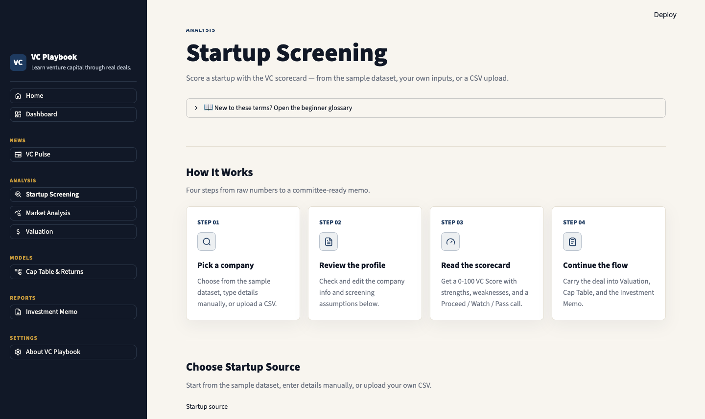
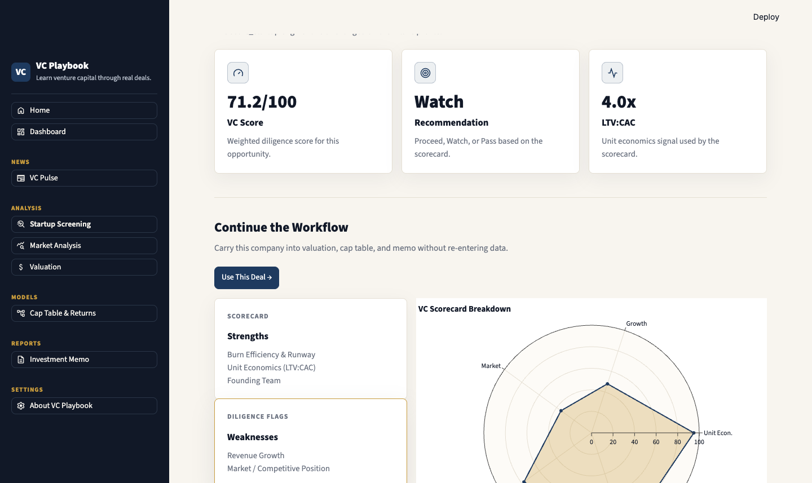
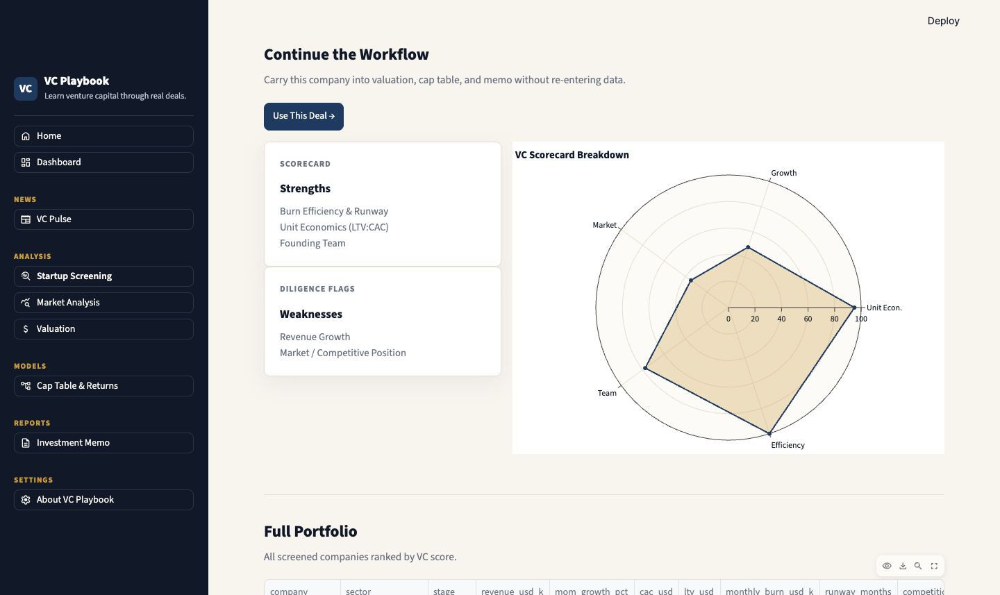
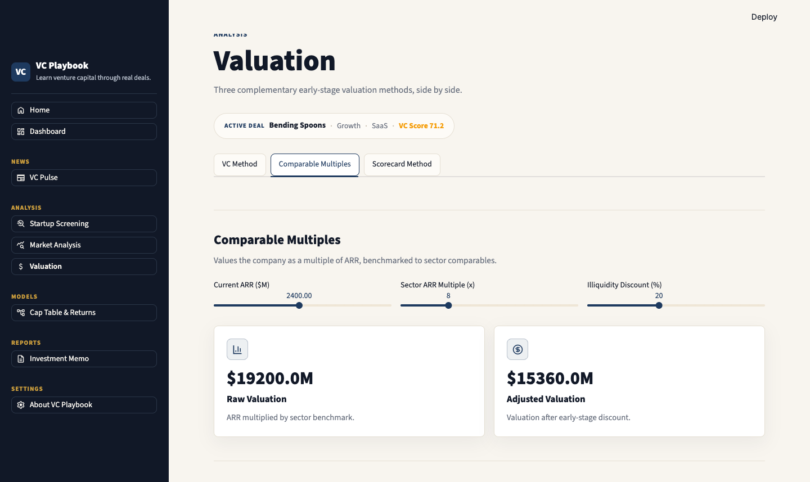
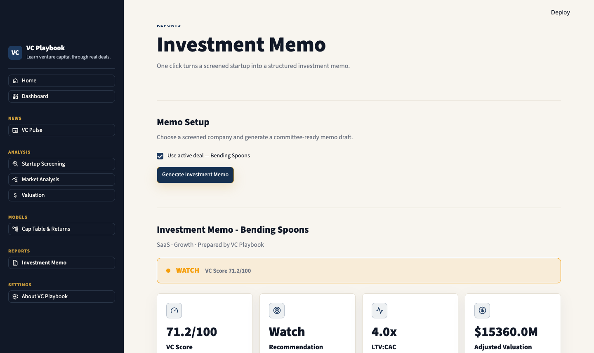

# Case Study: Running Bending Spoons Through VC Playbook

*July 2026 · All inputs are public, disclosed figures from the company's Nasdaq IPO
(July 1, 2026) and press coverage — except CAC/LTV, which are labeled analyst
assumptions. This is an educational exercise, not investment advice.*

## The company

Bending Spoons (Nasdaq: BSP) is the Milan-based technology company that acquires
proven consumer software products — Evernote, Vimeo, WeTransfer, Eventbrite, AOL —
and operates them for the long term. Founded 2013 by Luca Ferrari and three
cofounders. It IPO'd on July 1, 2026 at $29/share (~$18.4B), priced above range,
and closed its first day near a $25B market value.

## The inputs (and where they came from)

| Input | Value | Source |
|---|---|---|
| Revenue run-rate | ~$2.4B ARR | Q1 2026 revenue $601.3M × 4 (disclosed) |
| Growth | ~7.3% MoM | Q1 2026 revenue +132% YoY (disclosed), converted to monthly |
| Profitability | ~breakeven burn | 2025 adj. EBITDA ~$700M, guided to ~$1.4B in 2026 (disclosed) |
| Team | 4,418 | Reported headcount, Dec 2025 |
| Founder experience | 9/10 | Second-time operators, 13-year track record |
| Competition | High | Consumer subscription apps |
| LTV:CAC | 4x (assumed $120 / $30) | **Not disclosed — analyst assumption** |
| Sector ARR multiple | 8x | Conservative SaaS comp benchmark |

## What the simulator said

**Scorecard: 71.2/100 — "Watch."**
Unit economics 95, efficiency 100 (profitable, effectively infinite runway),
team 78 — but growth scored 48 and market 35. Why "Watch" for one of Europe's
best outcomes? Because the framework is calibrated for *early-stage* deals:
7.3% MoM is below the 8% Seed benchmark that anchors a score of 50, and "High"
competition takes a fixed penalty. That's the most instructive part of the
exercise — a scorecard built for seed-stage triage *should* look skeptically at
growth-stage profiles, and seeing where a framework strains teaches you more
than seeing it flatter.

**Comparable multiples: $19.2B raw.**
$2.4B ARR × 8x = **$19.2B — within ~4% of the actual $18.4B IPO pricing.**
With the default 20% early-stage illiquidity discount the model shows $15.4B;
for a liquid, listed company that discount should be ~0%, which again is the
model teaching you *when its assumptions apply*. First-day close (~$25B) implied
~10x run-rate revenue — the market paying up for the EBITDA doubling guidance.

**Memo:** one click produced the structured IC draft (thesis, risks, valuation,
next steps) — downloadable as PDF in `assets/case-study/`.

## What I learned

1. **Frameworks encode a stage.** The same numbers that make an IPO succeed
   (profitable, compounding, diversified) score as "Watch" on a seed lens that
   wants 3x-ing revenue and winner-take-all markets.
2. **Simple comps get you surprisingly far.** One multiple on honest ARR landed
   within a few percent of where bankers priced a $18B listing.
3. **Disclosures matter.** This case study was only possible because the IPO
   forced real numbers into the open — the same exercise on a private company
   would be assumption-stacking.

---

## LinkedIn post draft

> **I ran Bending Spoons' IPO numbers through the VC due-diligence simulator I built. It said "Watch."** 🧐
>
> Bending Spoons listed on Nasdaq this month at $18.4B — Europe's biggest tech
> listing in years. I fed the disclosed numbers ($2.4B run-rate revenue, +132%
> YoY, EBITDA-profitable, 4,418 people) into VC Playbook, the open-source
> diligence simulator I've been building.
>
> Two results worth sharing:
>
> 📊 The comps module priced it at $19.2B — within 4% of the actual IPO pricing,
> from one honest multiple on run-rate ARR.
>
> ⚠️ The seed-stage scorecard gave it 71/100, a "Watch." Not because the company
> is weak — because frameworks encode a stage. A seed lens wants 3x-ing revenue
> and hates crowded markets; an IPO-scale acquirer optimizes for profit and
> durability. Watching a framework strain teaches you more than watching it
> flatter.
>
> Full walkthrough with screenshots and the auto-generated IC memo in the repo
> (link in comments). All inputs are public IPO disclosures; CAC/LTV are labeled
> assumptions.
>
> Built as a first-year at Bocconi x ESSEC, learning VC in public.
>
> #VentureCapital #IPO #BendingSpoons #BuildInPublic

---

### Screenshots

