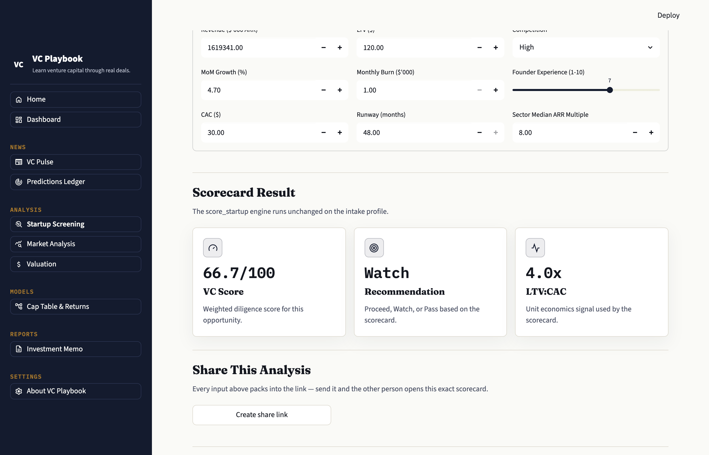
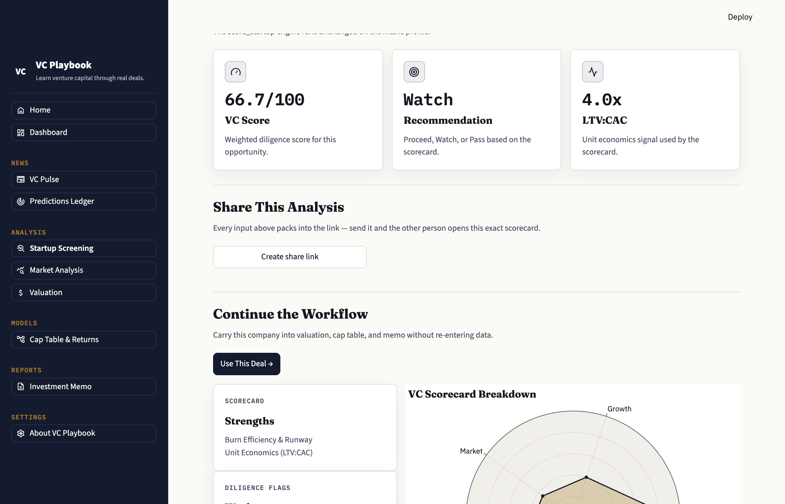
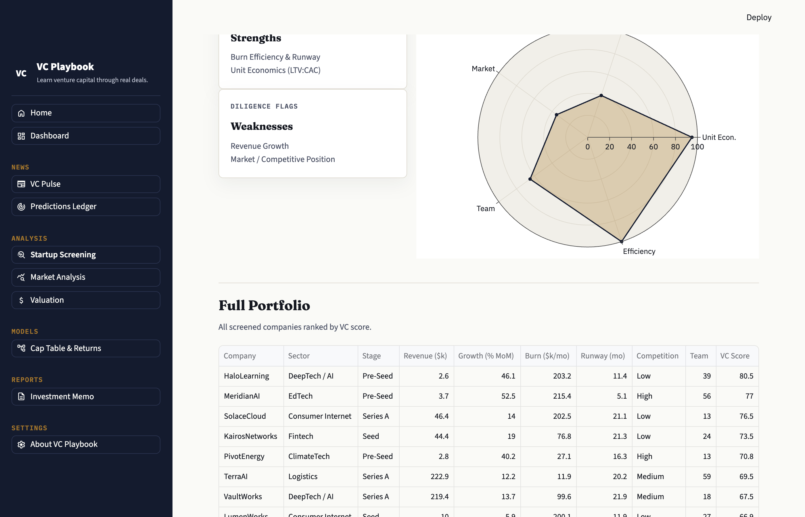
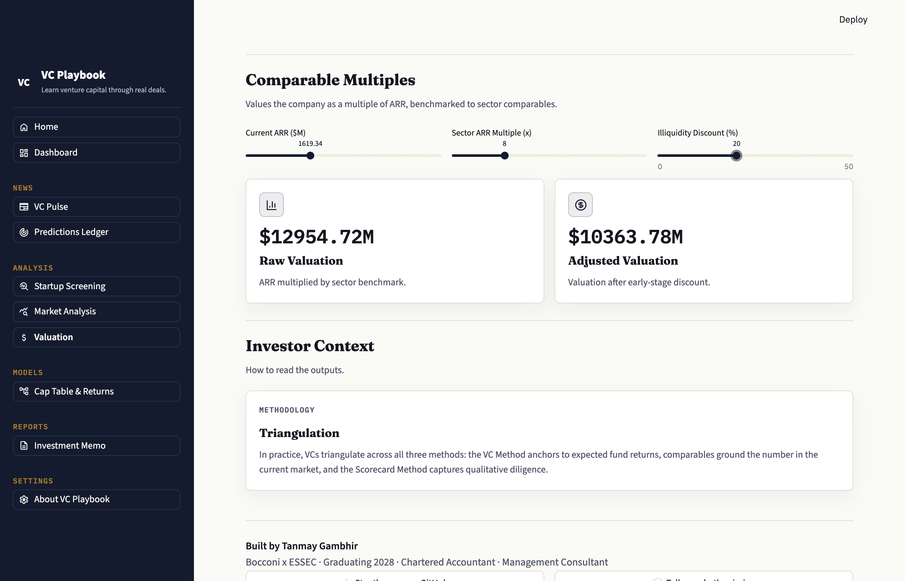
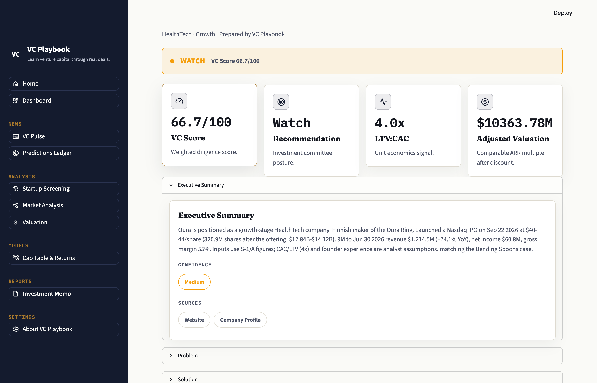

# Case Study 2: Calling Oura's IPO Before It Prices

*Pre-registered 2026-09-23, before pricing. All inputs are disclosed figures
from Oura's S-1/A (Sep 21, 2026) and free-writing prospectus (Sep 22, 2026),
except LTV:CAC and founder experience, which are labeled assumptions. The
Outcome section is filled only after the deal prices. Educational exercise,
not investment advice.*

**New to finance?** Read "The 60-second version" and "How an IPO works"
first. Every term in **bold** is explained in the [glossary](#glossary) at
the end.

---

## The 60-second version

Oura, the company that makes the Oura smart ring, is about to start selling
its shares on the Nasdaq stock exchange. Before that happens, its bankers
have to set a price. They've said it will be between $40 and $44 a share.

We gave VC Playbook the same public numbers the bankers have and asked it
what Oura is worth. It said **about $12.95 billion, or $40.36 a share**. We're
writing that down *now*, before the real price is set, so nobody can say we
adjusted it afterwards. When Oura prices, we'll publish how far off the model
was, whether it was close or not.

---

## How an IPO works, in five steps

1. **The company files a prospectus.** An **IPO** (initial public offering)
   is when a private company first sells shares to the public. First it
   files an **S-1** with the US regulator (the SEC): a long document with its
   real financial numbers. That's where our inputs come from.
2. **The bankers set a price range.** Oura's is $40–44 a share.
3. **The roadshow.** For about a week, the company pitches big investors
   (pension funds, mutual funds) who say how many shares they'd buy and at
   what price. This list of orders is called the **book**.
4. **Pricing night.** The evening before trading starts, the company and
   bankers fix one final **IPO price** based on the book. Strong demand can
   push it *above* the range.
5. **First day of trading.** Anyone can now buy the shares on the exchange.
   The price often jumps on day one (an **IPO pop**), partly because banks
   deliberately price a little low.

**We score step 4, the IPO price.** It's the professional investors'
considered view of what the company is worth, which is the same question our
model answers. The day-one close (step 5) is driven by hype and a small
number of tradable shares, so we record it but don't score it. The Bending
Spoons case did the same: it priced at $18.4B and closed its first day near
$25B, and the "within 4%" result was measured against the $18.4B.

---

## The company

Oura (Nasdaq: OURA, proposed) makes the Oura Ring, a health-tracking ring
sold with a paid monthly membership. It was founded in Finland in 2013. On
Sep 22, 2026 it launched a 50M-share IPO at **$40–44 per share**:

- **13.5M new shares** from the company (**primary shares**: money goes to Oura)
- **36.5M shares** sold by existing investors (**secondary shares**: money goes to them)

With **320.9M shares outstanding** after the offering, the range values the
whole company at **$12.84B–$14.12B**. This is its **market value** (also
called market cap): share price × number of shares.

---

## Key numbers at a glance

| Number | Value | What it means |
|---|---|---|
| Revenue, 9 months to Jun 2026 | $1,214.5M | Money from sales over nine months |
| Revenue growth | +74.1% vs a year earlier | Sales grew by about three-quarters in a year |
| Revenue, full fiscal 2025 | $907.9M (+123% vs 2024) | Growth is fast but slowing from 2025's pace |
| Hardware vs membership | $974.0M vs $240.5M (80% / 20%) | Most money comes from selling rings, not subscriptions |
| **Gross margin** | 55% (up from 51%) | Of each $1 of sales, 55¢ is left after the cost of making the product |
| **Net income** | $60.8M | Oura is profitable: it made money after all costs |
| **Adjusted EBITDA** | $106.7M | A profit measure that strips out some non-cash and one-off items |
| Paid members | 5.0M (from 2.5M a year earlier) | Membership doubled in a year |
| 12-month member retention | ~85% | About 85 of every 100 members are still paying a year later |
| Daily active users / monthly | ~65% | Most members use the app most days |

*Source: Oura S-1/A. Oura's fiscal year ends Sep 30.*

---

## Step 1: What is Oura worth? (the comps method)

**The idea in one line:** find what similar companies are worth per dollar of
revenue, then apply that to this one.

**An everyday version:** if flats on your street sell for about €4,000 per
square metre, a 100 m² flat is worth about €400,000. **Comps** (short for
comparable companies) does the same with companies, using revenue in place
of square metres.

**The math:**

| Step | Calculation | Result |
|---|---|---|
| 1. Yearly revenue (**run-rate**) | $1,214.5M in 9 months ÷ 9 × 12 | $1,619.3M |
| 2. Apply the **revenue multiple** | $1,619.3M × 8 | **$12,954.7M ≈ $12.95B** |
| 3. Per share | $12,954.7M ÷ 320.9M shares | **$40.36** |
| 4. Compare with the range | $40–44 a share = $12.84B–$14.12B | Model sits near the bottom, 3.9% below the $42 midpoint |

**Where the 8x comes from:** it's the app's default multiple, the same one
used for Bending Spoons in July. We did *not* choose a new one for Oura, on
purpose. By the time we ran this, the $40–44 range was public, so picking a
multiple then would have let us aim at the answer. Reusing the old setting
means we're testing the tool, not our guessing.

**Why it might not fit:** 8x is a typical *software* multiple. Software is
cheap to copy, so each extra sale is almost pure profit. A ring has to be
manufactured and shipped, which is why Oura's gross margin is 55%, not the
75–80%+ typical of software. Hardware companies usually get lower multiples.
So if the call lands, part of the reason may be that investors value Oura
like a subscription business. We're noting that now, not after the result.

---

## Step 2: Would a VC like it? (the scorecard)

**The idea:** a report card with five subjects, each weighted by how much a
seed-stage investor cares about it. The total decides the verdict:
**75+ Proceed · 55–75 Watch · below 55 Pass**.

| Subject | Weight | What it asks | Oura | Score |
|---|---|---|---|---|
| **Unit economics** | 30% | Is each customer worth more than it costs to win them? (**LTV:CAC**) | 4x, assumed | 95 |
| Growth | 25% | How fast are sales growing each month vs an 8% target? | 4.7%/month | 40.1 |
| Market | 15% | How crowded is the market? | High competition | 35 |
| Team | 20% | Founder experience + team size | 7/10, large team | 64.8 |
| Efficiency | 10% | How fast does it spend cash, and how long can it last? (**burn**, **runway**) | Profitable | 100 |
| **Total** | | | | **66.7: Watch** |

**Turning yearly growth into monthly:** growing 74.1% in a year is the same
as about 4.7% a month compounded (1.0473 multiplied by itself 12 times ≈
1.741). The scorecard is built for young startups, where 8% a month is the
benchmark, so Oura scores low on growth even though 74% a year is excellent
for a company this size. Same lesson as Bending Spoons: **a tool built for
one stage judges other stages harshly.** Knowing when a framework applies is
part of the skill.

**The 4x LTV:CAC is a guess.** Oura doesn't publish what it costs to win a
customer (**CAC**) or what a customer is worth over their lifetime
(**LTV**). We reused the Bending Spoons assumption so we couldn't pick a
flattering one. Because it carries 30% of the score, here's how much it
matters:

| If the true figure were… | Score | Verdict |
|---|---|---|
| Founder score 6–9 (not 7) | 65.5–69.3 | Watch |
| LTV:CAC 5x | 68.2 | Watch |
| LTV:CAC 3x | 60.7 | Watch |
| LTV:CAC 2x | 54.7 | **Pass** |

The verdict holds unless Oura's customer economics are much weaker than
assumed.

The scorecard and the valuation are separate. The scorecard asks "would a
seed investor like this profile?"; comps asks "what is it worth?"

---

## The call (pre-registered)

**Headline result: the model's % error vs the final IPO price.**

> Error = (model value − actual value) ÷ actual value.
> Model value = **$12.95B**. Actual value = final IPO price × shares
> outstanding after the offering, from the final prospectus.

This is the number we'll publish, whatever it is, just like "within 4%" for
Bending Spoons.

**Pass/fail line:** a **hit** if Oura prices within ±10% of the model:

| Oura prices at | Market value | Result |
|---|---|---|
| Below $36.33 | under $11.66B | Miss: priced well below the model |
| $36.33 – $44.40 | $11.66B – $14.25B | **Hit** |
| Above $44.40 | over $14.25B | Miss: above-range deal, as Bending Spoons had |

Plain-English caveat: the hit band covers the whole $40–44 range, so a hit
mostly means "Oura didn't price above its range." That's why the % error is
the headline, not hit/miss.

- **Recorded, not scored:** the first-day close.
- **If the range changes before pricing,** the model's number stays at
  $12.95B and the change gets written down here.

## Why the model could be wrong

1. **Right for the wrong reason.** The 8x software multiple doesn't reflect
   that Oura is mostly hardware (see Step 1).
2. **Hot deals price above range.** Bending Spoons did. Strong demand here
   would mean a miss.
3. **Mostly a sale by existing investors.** 36.5M of the 50M shares are
   secondary. The model doesn't see this, but the market might read it as
   insiders cashing out.

---

## Outcome: PENDING (fill after pricing, from the final prospectus)

- Final IPO price and market value: _to be filled_
- **Model error:** _to be filled_
- Hit or miss against $11.66B–$14.25B: _to be filled_
- First-day close (recorded, not scored): _to be filled_
- What I learned, including "the model got lucky" if that's the honest read:
  _to be filled_

---

## Try it yourself

1. Open [VC Playbook](https://vcplaybook.streamlit.app) and go to **Startup Screening**.
2. Upload `oura.csv` (download button at the end of this case study). It holds every input above.
3. Read the scorecard. Then change the LTV:CAC and watch the verdict move.
4. Go to **Valuation**, set the multiple to 8x and the illiquidity discount to 0% (Oura will be publicly traded, so its shares are easy to sell).
5. Try other multiples. What multiple would the top of the range ($44) imply? *(Answer: about 8.7x.)*

---

## Screenshots

Captured from the app on 2026-09-23, with `oura.csv` loaded.

**1. Intake:** Oura's S-1 numbers in the screening form.

**2. Scorecard:** 66.7/100, "Watch", on an assumed 4.0x LTV:CAC.

**3. Radar:** strong on unit economics and efficiency, weak on growth and market.

**4. Comps:** $12,954.72M raw. The 20% illiquidity discount is shown at its
default; for a company about to list, the raw figure is the one that counts.

**5. Memo:** the one-click investment memo draft. Its headline valuation is
the *discounted* $10.36B because the memo always applies the default 20%
illiquidity discount; for Oura the raw $12.95B is the figure the call uses.

---

## Glossary

| Term | Plain English |
|---|---|
| **IPO** | Initial public offering: the first time a company sells shares to the public on a stock exchange. |
| **S-1 / prospectus** | The document a company files with the SEC before an IPO, with its audited numbers and risks. |
| **Roadshow** | The week or so when the company pitches big investors before setting the price. |
| **Book** | The list of investor orders collected during the roadshow. Strong book = high demand. |
| **IPO price** | The one price set the night before trading, at which investors in the offering buy. |
| **IPO pop** | A jump in the share price on the first day of trading. |
| **Shares outstanding** | The total number of shares that exist. Owning 1% of them means owning 1% of the company. |
| **Market value / market cap** | Share price × shares outstanding: what the whole company is worth at that price. |
| **Primary shares** | New shares the company creates and sells. The cash goes to the company. |
| **Secondary shares** | Existing shares sold by current owners (founders, VCs). The cash goes to them. |
| **Float** | Shares that can actually trade. Here, about 50M of 320.9M. |
| **Revenue** | Total money from sales, before any costs. |
| **Run-rate** | Recent revenue scaled up to a full year, e.g. 9 months × 12/9. |
| **YoY / MoM** | Year-over-year / month-over-month: growth vs the same period a year / month earlier. |
| **Gross margin** | Share of revenue left after the direct cost of making the product. |
| **Net income** | Profit after every cost, including tax. Positive = profitable. |
| **Adjusted EBITDA** | Earnings before interest, tax, depreciation and amortization, adjusted for some one-off or non-cash items. A rough view of operating profit. |
| **Revenue multiple** | Company value ÷ yearly revenue. "8x" means worth 8 years of current sales. |
| **Comps** | Valuing a company by comparison with similar ones, usually via a multiple. |
| **Illiquidity discount** | A haircut for shares that are hard to sell (private companies). Not needed once listed. |
| **CAC** | Customer acquisition cost: what it costs to win one customer (ads, sales). |
| **LTV** | Lifetime value: profit a customer brings over the whole time they stay. |
| **LTV:CAC** | LTV ÷ CAC. 3x is the classic "healthy" benchmark: each customer returns three times what they cost. |
| **Burn** | How much cash a company loses per month. Zero if profitable. |
| **Runway** | How many months until the cash runs out at the current burn. |
| **Retention** | Share of customers still paying after a period (here, 12 months). |
| **Pre-registration** | Writing down your prediction and how you'll judge it *before* the result exists, so you can't move the goalposts. |

---

## Sources

- Oura Inc., Form S-1/A, Sep 21, 2026: https://www.sec.gov/Archives/edgar/data/0002133022/000119312526396051/d119865ds1a.htm
- Oura Inc., Form FWP (IPO launch), Sep 22, 2026: https://www.sec.gov/Archives/edgar/data/0002133022/000119312526396384/d79478dfwp.htm
- TechCrunch, "Oura's $2.2B IPO is mostly a payday for existing shareholders," Sep 21, 2026: https://techcrunch.com/2026/09/21/ouras-2-2b-ipo-is-mostly-a-payday-for-existing-shareholders/
